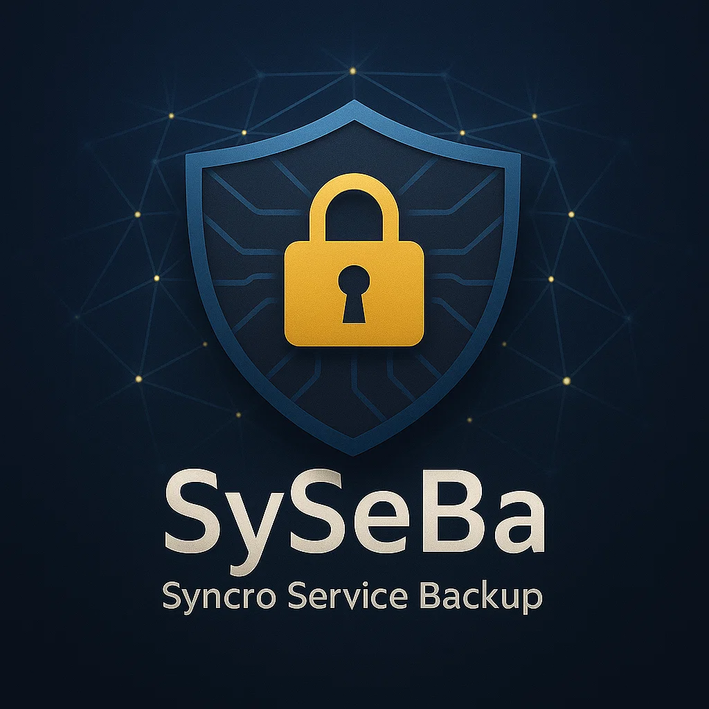

# SySeBa 2



[English](README.md) | [Guida completa italiana](ReadmeAI.md) |
[Complete English guide](ReadmeAI.en.md)

SySeBa è un servizio di backup continuo nativo C11 per Windows, Linux e
macOS. Esegue una sincronizzazione iniziale parallela, osserva le modifiche
della sorgente, mantiene la copia corrente in `backup` e sposta gli elementi
eliminati in un'area `restore` consultabile.

La versione 2 non richiede Python. Un solo eseguibile contiene motore
filesystem, dashboard console bilingue, CLI, audit SQLite, Web UI protetta da
token, browser di restore e integrazione nativa con i servizi di sistema.

## Linee di rilascio

- **SySeBa 2.x (C nativo)** e la linea corrente su `main`, con pacchetti per
  Linux, Windows e macOS.
- **SySeBa 1.x (Python Legacy)** rimane disponibile nel ramo
  [`legacy/python`](https://github.com/okno/SySeBa/tree/legacy/python) e nella
  sezione
  [GitHub Releases](https://github.com/okno/SySeBa/releases/tag/v1.0.0-python)
  per compatibilita e rollback esatto.

Entrambe le implementazioni rimangono scaricabili. Le nuove funzioni e il
supporto di nuove piattaforme riguardano la linea C nativa; la linea Python
resta disponibile per le installazioni esistenti e per correzioni critiche di
compatibilita o sicurezza.

## Funzioni principali

- Watcher nativi: inotify su Linux, `ReadDirectoryChangesW` su Windows e
  polling portabile come fallback.
- Worker concorrenti controllati e writer dei log serializzato dedicato.
- Sostituzione atomica dei file, verifica di stabilità della sorgente, retry e
  lock di kernel per impedire istanze duplicate.
- Migrazione automatica di ogni vecchio schema SQLite `logs`, inclusi i
  database privi della colonna `level`.
- CLI, dashboard, Web UI, messaggi e guide in italiano e inglese.
- Stato, metriche di processo/disco, log live, configurazione validata,
  riavvio servizio, ricerca, anteprima, download e recupero dall'area restore.
- Unit systemd irrobustita, Windows Service e LaunchDaemon macOS.
- Snapshot a servizio fermo, rollback esatto, checksum e rollback automatico
  quando un aggiornamento non supera il controllo di salute.

## Artefatti di rilascio

Scarica le versioni pubblicate da
[GitHub Releases](https://github.com/okno/SySeBa/releases). Il builder locale
produce:

| Piattaforma | Artefatto |
|---|---|
| Linux x86_64 | Bundle portabile `.tar.gz` |
| Debian/Ubuntu x86_64 | Pacchetto `.deb` |
| Linux RPM x86_64 | Pacchetto `.rpm` |
| Windows 11/Server x86_64 | `.zip` portabile e setup NSIS `.exe` |
| macOS 11+ Intel e Apple Silicon | `.dmg` Universal 2 |
| Sorgente | `.tar.gz` completo con dipendenze vendorizzate |

Esegui `scripts/build-release.sh` da Linux/WSL oppure
`scripts/build-release.ps1` da Windows. Gli artefatti finiscono in `dist/`;
gli script non pubblicano e non eseguono push.

## Installazione Linux

Da pacchetto:

```bash
sudo apt install ./syseba_2.0.0_amd64.deb
sudoedit /etc/syseba/syseba.conf
sudo systemctl enable --now syseba.service
```

Da sorgente:

```bash
cmake -S . -B build -G Ninja -DCMAKE_BUILD_TYPE=Release
cmake --build build --parallel
ctest --test-dir build --output-on-failure
sudo cmake --install build
sudo syseba service-install --config /etc/syseba/syseba.conf --lang it
```

Configurazione Linux predefinita:

```ini
[SETTINGS]
source = /srv/syseba/source
backup = /srv/syseba/backup
restore = /srv/syseba/restore
log = /var/log/syseba/syseba.log
threads = 4
```

## Migrazione dalla versione Python

Non sovrascrivere manualmente `/opt/syseba`. Usa un checkout separato:

```bash
cd /root/SySeBa-release
git status --short
git pull --ff-only origin main
sudo ./scripts/migrate-from-python.sh
```

Lo strumento compila e testa il candidato C mentre il vecchio demone è ancora
attivo; poi arresta il servizio, crea uno snapshot con checksum nella
directory corrente, preserva configurazione/database/log/token, sostituisce
atomicamente l'installazione, avvia il servizio con Web UI e verifica la
salute. Se il controllo fallisce ripristina automaticamente l'installazione
precedente.

Rollback esatto:

```bash
sudo ./scripts/syseba-maintenance.sh rollback
sudo ./scripts/syseba-maintenance.sh rollback pre-update
```

Il comando interattivo elenca gli snapshot software disponibili prima della
conferma. Gli alberi configurati `source`, `backup` e `restore` non vengono
mai inclusi o modificati dagli snapshot software.

## Web UI e log

Il servizio installato avvia sempre la Web UI sulla porta `8765`:

```text
http://IP_DEL_SERVER:8765
```

Token e log su Linux:

```bash
sudo cat /etc/syseba/syseba_web.token
sudo journalctl -fu syseba.service -o short-iso-precise
sudo tail -n 200 -F /var/log/syseba/syseba.log
```

Il server integrato usa HTTP. Limita la porta `8765` alla LAN/VPN fidata o
usa un reverse proxy TLS autenticato. Non esporlo direttamente a Internet.

## CLI

```text
syseba run
syseba status [--json]
syseba logs --lines 200
syseba config-check
syseba restore-list [--search TESTO] [--json]
syseba restore-copy --path RELATIVO [--rename|--overwrite]
syseba restore-browser
syseba service-install
```

Esegui `syseba --help --lang it` per tutte le opzioni.

## Documentazione

- [Guida completa italiana](ReadmeAI.md)
- [Complete English guide](ReadmeAI.en.md)
- [Architettura](docs/ARCHITECTURE.md)
- [Build e release](docs/BUILD.md)
- [Modello di sicurezza](docs/SECURITY.md)
- [Operatività e osservabilità](docs/OPERATIONS.md)
- [Migrazione e rollback](docs/MIGRATION.md)
- [API HTTP](docs/API.md)
- [Test](docs/TESTING.md)
- [Packaging](docs/PACKAGING.md)

## Licenza

SySeBa è distribuito con licenza MIT. Consulta [LICENSE](LICENSE) e
[THIRD_PARTY_NOTICES.md](THIRD_PARTY_NOTICES.md).
